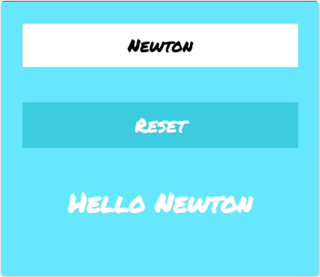

# Hello React

It's a relatively small project, in which we will use all of the techniques we've read about so far:

- Passing props.children with JSX
- Handling DOM events
- Managing state
- Conditional rendering
- Controlled inputs

We will write in input field, and value of input will be displayed under button within `h1` tag. Pressing `Reset` button will empty input field and h1.

## `npm start`

Runs the app in the development mode.\
Open [http://localhost:3000](http://localhost:3000) to view it in your browser.

The page will reload when you make changes.\
You may also see any lint errors in the console.

## Screenshots

- Our React App will look like this:
 
